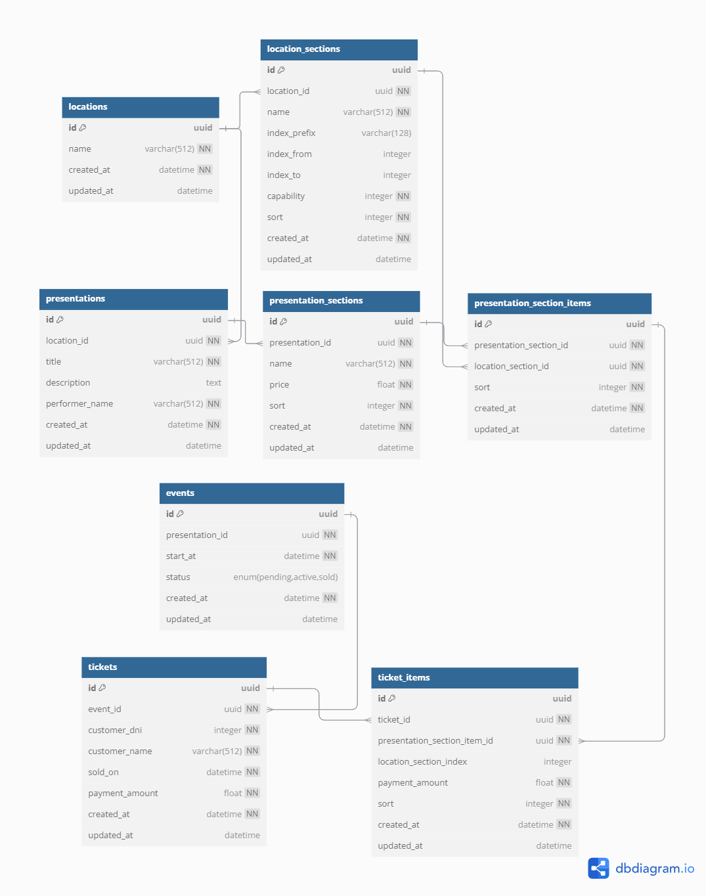
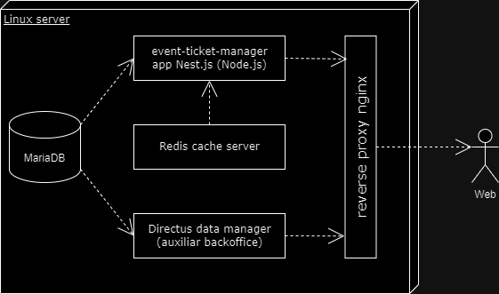

# Event Ticket Manager - Documento técnico

API para el sistema de gestión de locaciones, eventos y tickets. Permite configurar por parametría múltiples locaciones tales como teatros, estadios, campos, etc., definir los eventos a realizar (shows, por ejemplo) y gestionar la disponibilidad y venta de tickets al público.

## Modelo de datos

Es un modelo de datos relacional formado por las siguientes entidades:

- `locations` 
Lugares físicos tales como teatros, estadios, campos, etc.

- `location_sections` 
Sectores de cada locación tales como pisos, filas, areas, butacas, etc.

- `presentations` 
Shows, obras, disertaciones, etc. que serán presentadas.

- `presentation_sections` 
Sectorización o segmentación de cada presentación donde se pueden diferenciar distintos precios de tickets.

- `presentation_section_items` 
Detalles o ítems de cada sectorización donde se relaciona a estas con sus correspondientes sectores de locación.

- `events` 
Funciones (fechas) de cada show o presentación.

- `tickets` 
Tickets de venta relacionados con un cliente y el monto que pagó.

- `ticket_details` 
Detalles de cada ticket de venta donde consta cada localidad adquirida para un determinado evento y el monto abonado.

### Diagrama de Entidad Relación

El anterior diagrama se construyó con la herramienta [dbdiagram.io](https://dbdiagram.io). Con el archivo [event-ticket-manager.dbml](./event-ticket-manager.dbml) se puede editar en esta u otra herramienta compatible con el estándar.

## Arquitectura

La aplicación está basada en el framework [NestJS](https://nestjs.com), utilizando [Prisma ORM](https://www.prisma.io) para conectar con una base de datos [MariaDB](https://mariadb.org) y usando [Redis](https://redis.io) como servidor de cache para optimizar el acceso a datos.

En la actual implementación, el sistema se encuentra desplegado en un cloud VPS Linux en única instancia que contiene la aplicación, base de datos y servidor de cache Redis. No obstante aquello, la solución está preparada para escalar ya que soporta el funcionamiento con múltiples instancias de la misma. Eventualmente se podría desplegar en un gestor de contenedores.

Adicionalmente a la aplicación (totalmente desacoplado), se incluyó una instancia de Directus [Directus](https://directus.io) a modo de MVP backoffice para gestionar la información de manera visual.

